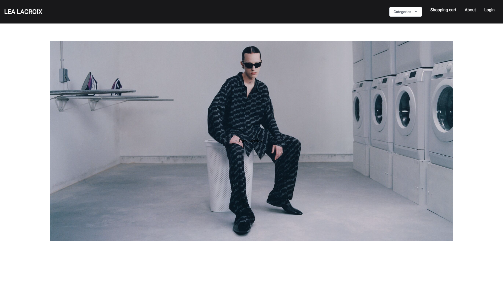
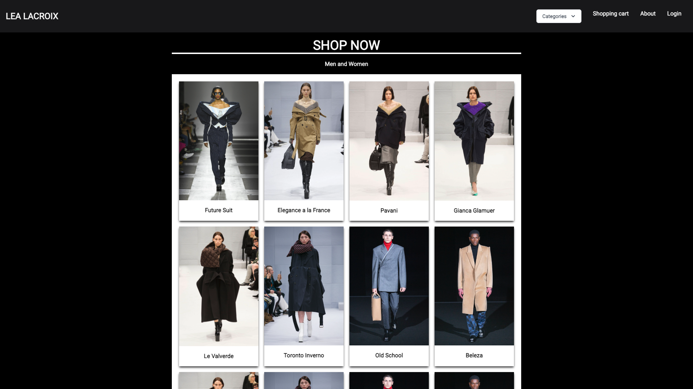

# Project 3

## Description

This project was the first collaborative MERN-stack single-page application, we combine a scalable MongoDB back end, a GraphQL API, and an Express.js and Node.js server with a React front end, implementing user authentication with JWT to build a user-focused platform. 

Since the world is advancing quickly, most businesses use online platforms. 
So we wanted to show an example of e-commerce and the different things that can be done in it.
Our project shows an e-commerce site that provides a seller profile and a user profile, including reviews and a wishlist.
It also includes a payment platform.

## Links

[Deployed application](https://facebook.github.io/create-react-app/docs/getting-started).

[GitHub repository](https://github.com/andresparraarze/project-3.git).

## Mock-Up

The following animation demonstrates the application functionality:

